# AGUIT: Attribute Guided Unpaired Image Translation

<div style="font-size=0"> 
    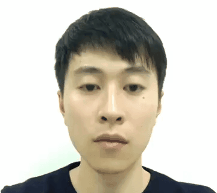
    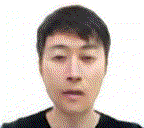
	
    
    
</div>

<div style="font-size=0"> 
    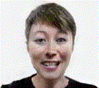
    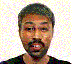
	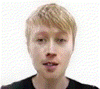
    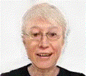
    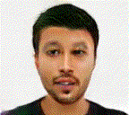
</div>

<div style="font-size=0"> 
    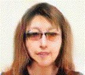
    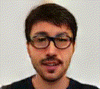
	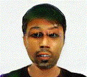
    
    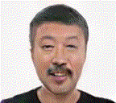
</div>

Code will be available soon.

### [Project](https://github.com/imlixinyang/aguit) | [Paper](https://arxiv.org/abs/1904.12428) | [Demo (Coming Soon)]()

"Attribute Guided Unpaired Image-to-Image Translation with Semi-supervised Learning." Li, X., Hu, J., Zhang, S., Hong, X., Ye, Q., Wu, C., & Ji, R. *arXiv preprint.*


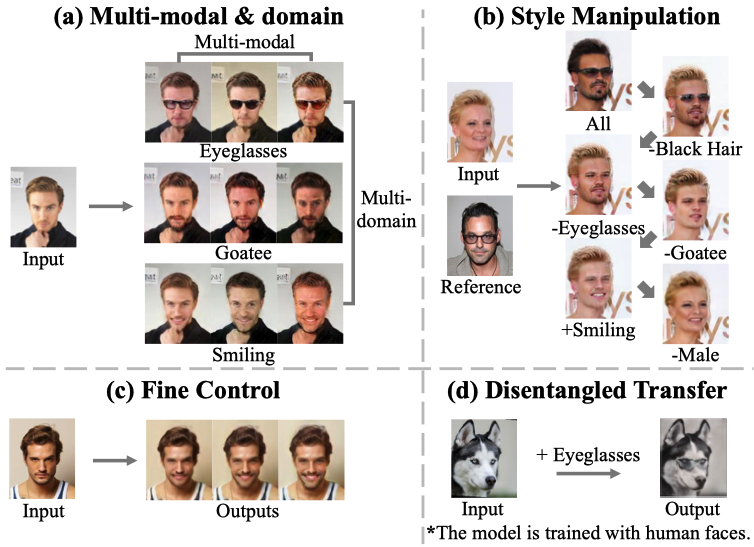

## Merits

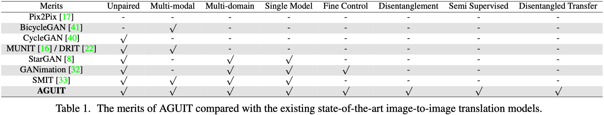

- **Unpaired**: Or *Unsupervised* in many works. The models are trained by using unpaired data in this setting. However, we prefer to term this as *Unpaired* instead of *Unsupervised* as the label of image domain (e.g., hair color, smile or not) is still needed.

- **Semi-Supervised**: An attempt to reduce the demand of such domain-labeled (or attribute-labeled) data in a semi-supervised setting. It means that some images in the training set are labeled and some are not.

- **Multi-Modal & Multi-Domain**: One/Many-to-Many translation.

- **Single Model**: All One/Many-to-Many translations are achieved by one single model.

- **Disentanglement & Fine Control**: The encoded attribute/domain representations are disentangled and can be fine controled.

- **Disentangled Transfer**: We introduce this new challenge for image-to-image translation community, which adopts the disentangled representation to translate data less related with the training set. For example, the models trained with human faces can be used to put eyeglasses on the dog's or cat's faces in the disentangled transfer.

## Citation

If our paper helps your research, please cite it in your publications:
```
@article{li2019attribute,
  title={Attribute Guided Unpaired Image-to-Image Translation with Semi-supervised Learning},
  author={Li, Xinyang and Hu, Jie and Zhang, Shengchuan and Hong, Xiaopeng and Ye, Qixiang and Wu, Chenglin and Ji, Rongrong},
  journal={arXiv preprint arXiv:1904.12428},
  year={2019}
}
```

If you have any problem, please feel free to contact us.

## Related Work

Our work benefits from code of [MUNIT](https://github.com/NVlabs/MUNIT), [DRIT](https://github.com/HsinYingLee/DRIT), [StarGAN](https://github.com/yunjey/stargan), etc.

